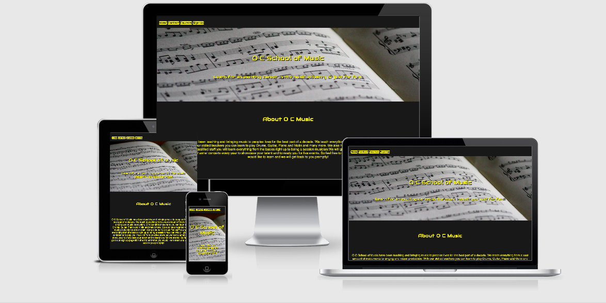
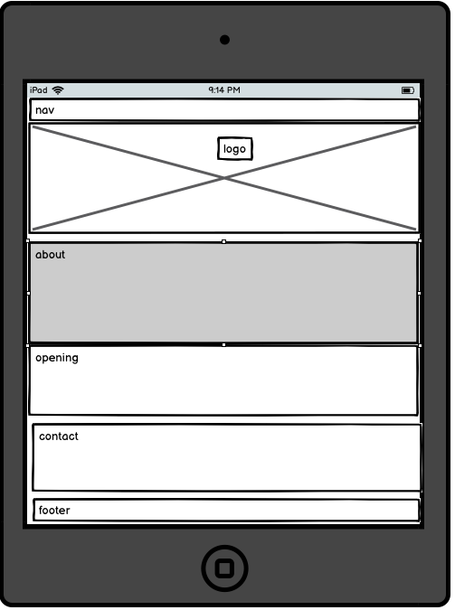
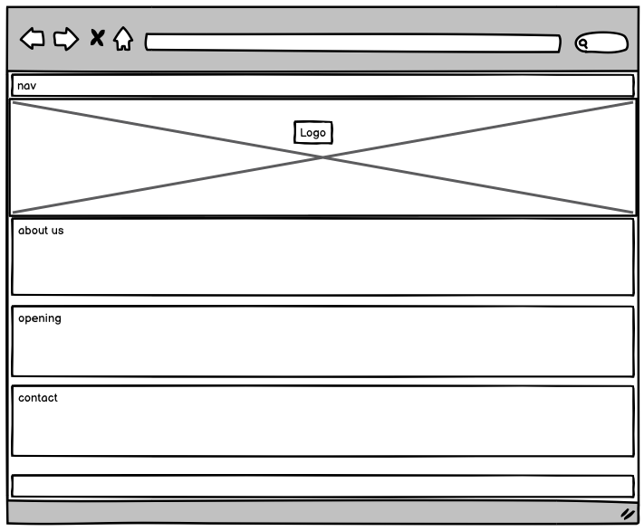
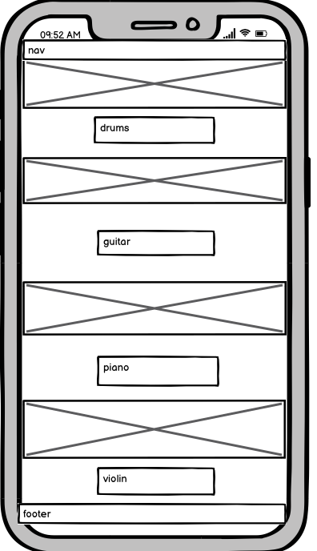
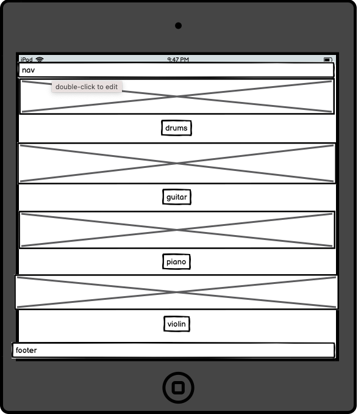
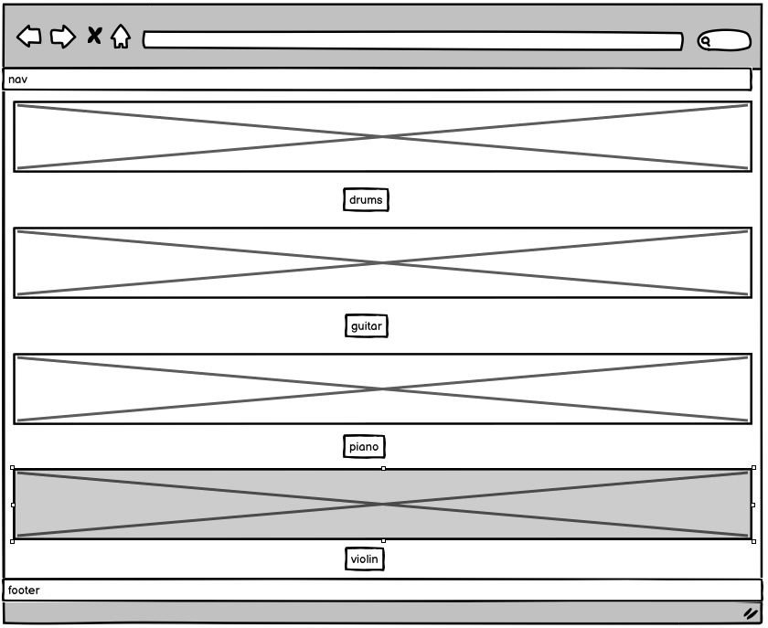
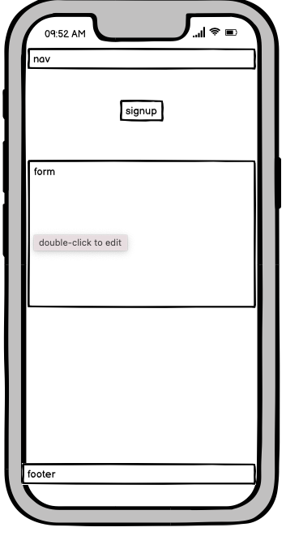
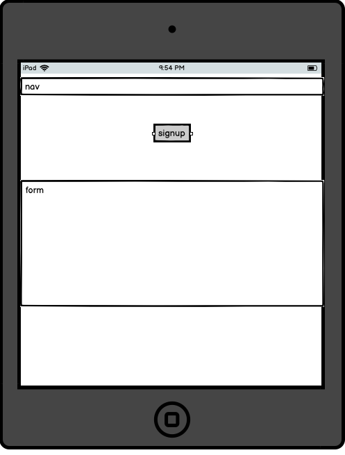
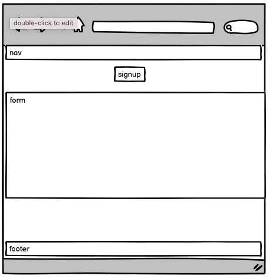
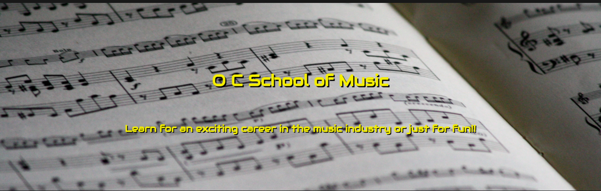

# O C School of Music

My goals in creating this website was to bring attention and gain business for a growing school of music. It was designed to be easy to use and to showcase some the types of courses the school has to offer. By creating the website it enables the school to reach out to a wider population and create a more substantial client base.

You can view the deployed site [here](https://paddyfa.github.io/milestone-project-1/)

# ux 

### The Strategy Plane

O C Music is a site intended to bring a user a music teaching service. The site was designed in a format that a muscian might use as a band profile. 

#### Goals of the Site

* To provide access to O C school of Music services.
* To create a responsive site to view on all devices.
* To ensure site is easily navigated.
* To preview different courses available.
* To provide contact information about the school
* To provide opening times of the school
* To link the site to the schools social media links
* To have easy accesabilty for screen readers.

### User Stories

As a user I want:

* To easily navigate the site.
* Know some info about the school.
* Be able to find contact details easily.
* To get some info on what the school teaches.
* To have an idea of fees charged.

As a site owner I want: 

* To navigate the site easily.
* For information to clear.
* To make the school more accessable to a wider population.
* The site to increase business for the school.

## Scope

* I went for simple easy to use site.
* I wanted a site that would be similar looking to a band profile.
* I wanted a site that looks good on all devices.
* I wanted the site to have a clear simple contact and sign up sections.

## Structure

* There is an easy to use site with everything that the user needs.
* The home page has all relative contact info and opening times.
* The courses page provides info and fees for each of the 4 courses displayed.
* The sign up page has a quick Name, Email, Message and instrument fields on the form.
* Links in the footer to provide access to all social media of the school

## Skeleton

Wireframes were used in the design of the site they were created using balsamiq. 

### Home page

### Courses page

### Signup page

## Features of the Site

### Nav bar:

The nav bar has 4 different buttons, a home button to return to home page. A contact button that links straight to the contact section on the same page. The courses button links to a page with a preview of 4 different courses the school has to offer and the sign up page is a page to input info to query any course availability. It is the same across all pages and full responsive on all devices. I have since changed this nav bars background color to yellow to create more of a flow in the page. I also removed one of the 4 buttons and now just have a Home, Contact and Courses buttons.

## Home Page

### Landing Picture

I picked a music sheet as a landing image for my site it appears in only the home page and is fully responive on all devices I think it conveys a music school quite well.

### About Section

