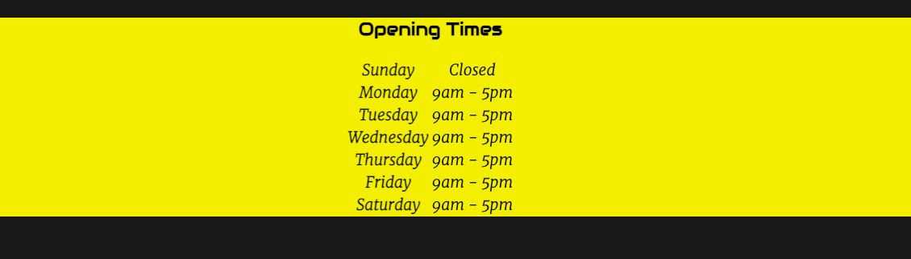
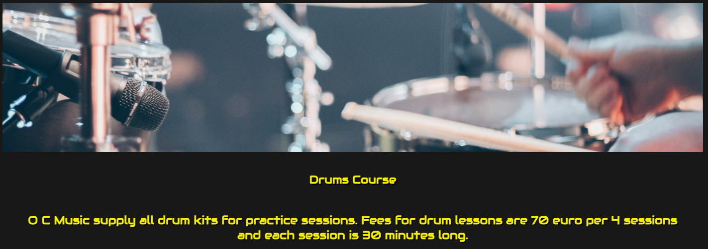
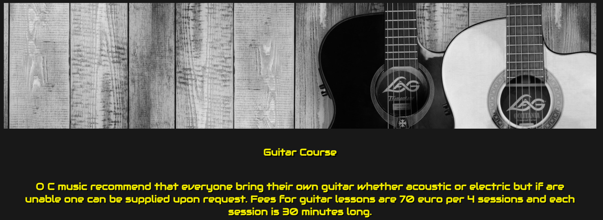
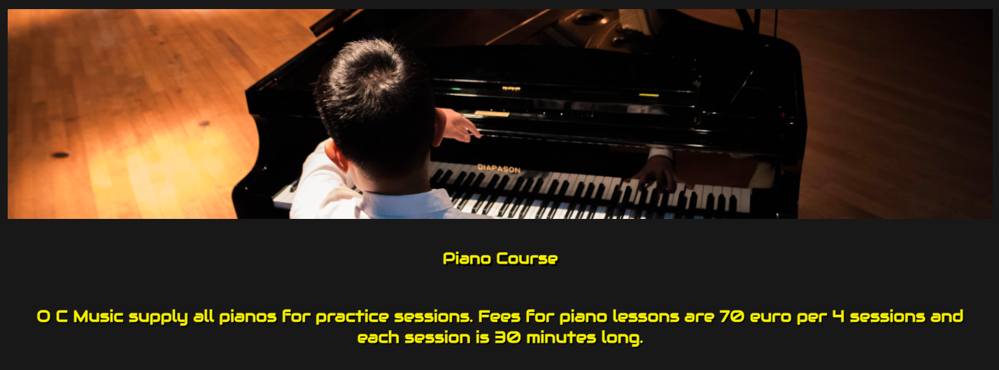
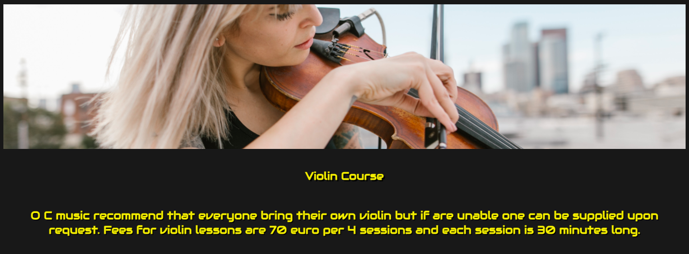
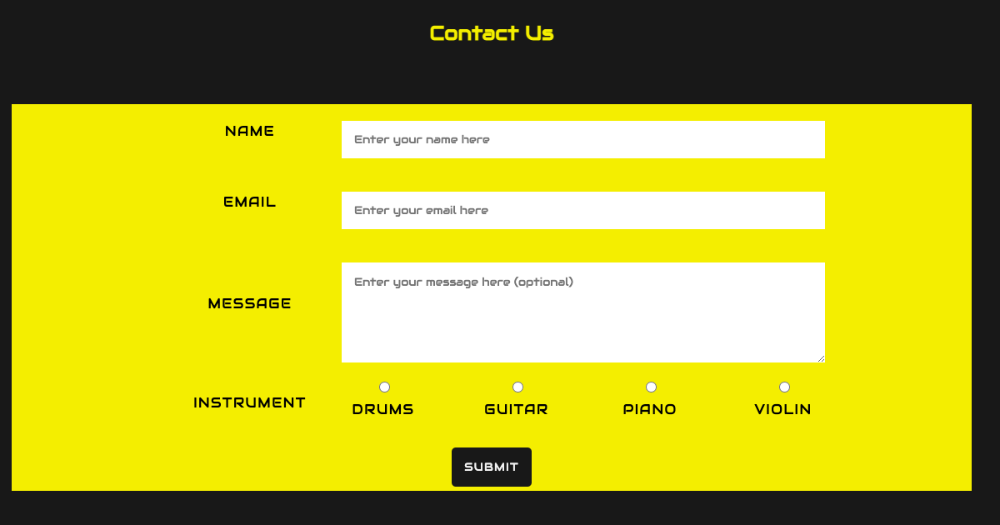
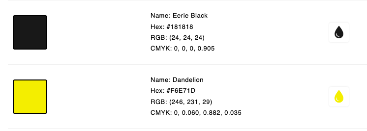
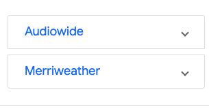

# O C School of Music

My goals in creating this website was to bring attention and gain business for a growing school of music. It was designed to be easy to use and to showcase some the types of courses the school has to offer. By creating the website it enables the school to reach out to a wider population and create a more substantial client base.

You can view the deployed site [here](https://paddyfa.github.io/milestone-project-1/)

# ux 

### The Strategy Plane

O C Music is a site intended to bring a user a music teaching service. The site was designed in a format that a muscian might use as a band profile. 

#### Goals of the Site

* To provide access to O C school of Music services.
* To create a responsive site to view on all devices.
* To ensure site is easily navigated.
* To preview different courses available.
* To provide contact information about the school
* To provide opening times of the school
* To link the site to the schools social media links
* To have easy accesabilty for screen readers.

### User Stories

As a user I want:

* To easily navigate the site.
* Know some info about the school.
* Be able to find contact details easily.
* To get some info on what the school teaches.
* To have an idea of fees charged.

As a site owner I want: 

* To navigate the site easily.
* For information to clear.
* To make the school more accessable to a wider population.
* The site to increase business for the school.

## Scope

* I went for simple easy to use site.
* I wanted a site that would be similar looking to a band profile.
* I wanted a site that looks good on all devices.
* I wanted the site to have a clear simple contact section.

## Structure

* There is an easy to use site with everything that the user needs.
* The home page has a video and a bit about the school.
* The courses page provides info and fees for each of the 4 courses displayed.
* The contact page has a quick Name, Email, Message and instrument fields on the form.
* Links in the footer to provide access to all social media of the school

## Skeleton

Wireframes were used in the design of the site they were created using balsamiq. 

### Home page

### Courses page

### Signup page

## Features of the Site

### Nav bar:

  

The nav bar has 3 different buttons, a home button to return to home page, a contact button that links straight to the contact page, the courses button links to a page with a preview of 4 different courses the school has to offer. It is the same across all pages and full responsive on all devices. 

## Home Page

### Landing Picture

I picked a music sheet as a landing image for my site it appears in only the home page and is fully responive on all devices I think it conveys a music school quite well.

### About Section

In the about section it describes a little bit about the company and what kind of courses they have to offer. Things that  the user might be interested knowing, for example the shows they put on and what you can learn. There is also a video embeded and is of a band called Explosions in the sky and the song your hand in mine which I think demonstrates some good examples of of good quality music playing.

### Opening Times

The opening times section lets the user know of times that the school is open and when they are closed this can be updated for bank holidays, it has a yellow background and black color and stands out to the user.

### Footer 

The footer contains a copyright message on the left hand side and has 4 social media links centered in the middle. Every link when clicked will open a new tab and direct the user to the relevent social media site. The footer apears on all pages in the site.

## Courses Page

The courses page is fully responsive and is a page that provides info on types of instruments, fees for courses and whether equipment will be needed there are 4 sections:

###  Drums

### Guitar

### Piano

### Violin

## Contact Page

The contact page is made up of a simple form. It has a Name, Email, Message and Instrument fields all info is required for all fields except the message is optional. After submitting a request a thank you page appears conforming the submit.

## Design Features 

### Colors Used

I went for a yellow and black color design for my page I think the two contrast each other well.

The two fonts used were Audiowide and Merriweather, I think they compliment each other well and the Audiowide font I think is an especially good font for a music site.

### Buttons 

  

All buttons on both the nav bar and footer all have a hover feature and change color when hovered over.

## Code Validation

### HTML:

All code was validated for html using W3c schools html valiadtor and you can view screenshots here:

* [Home Page](assets/images/homevalidator.png)
* [Courses Page](assets/images/coursesvalidator.png)
* [Contact Page](assets/images/contactvalidator.png)
* [Thank You Page](assets/images/thankyouvalidator.png)

### CSS

All code was validated for css using W3c schools css valiadtor and you can view screenshot here:

* [CSS](assets/images/cssvalidator.png)

### Accessibility 

All accessibility was checked using wave and all passed with only one alert to say there was an iframe on the page and screen shot can be viewed here:

* [Accessibility](assets/images/accessibilityvalidator.png)

## Manual Testing

 Testing was done using chrome dev tools:

 * Desktop 

  All pages responsive and tested good on desktop

* Ipad

  All pages responsive and tested good on ipad

* Iphone 

  All pages responsive and tested good on iphone

### Device testing

Tested on many devices and browsers. Android and Apple products all worked well and browsers like chrome and safari all tested good too. Using the am I responsive tool showed good reponsive layout on all devices.

## Bugs and Solutions

When testing on am I responsive the text for about us was pushed down into the opening times section.

The fix for the issue was to use a smaller font in the media queries for smaller screens.

## Deployment

Deployment was done as follows:

* In the Github repository click on the settings tab
* Scroll down to the new git hub pages section and click the link "check it out here"
* At the source section click the dropdown and pick main
* Then click save
* After you save it gives you a prompt that your git hub repository is ready to be published
* Then you just refresh the page and your live link is ready to share

## Credits

* Images used were from [Pexels](https://www.pexels.com/)
* [Youtube](https://www.youtube.com/) video was used on the home page

### Acknoledgements

* W3C and stack overflow for reference
* Code Institute for course material
* Slack community for help and a valuable resource for understanding problems and issues
* My mentor Rahul Lakhanpal for his time and guidance.

